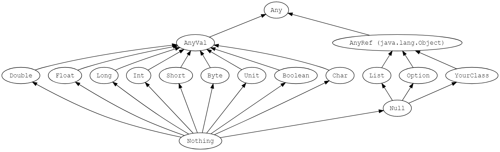

# Scala Tutorial

- [Scala Tutorial](#scala-tutorial)
  - [Basics](#basics)
  - [Concepts](#concepts)
  - [Formatting](#formatting)
    - [Currency Formatting](#currency-formatting)
  - [String](#string)
    - [String Interpolation](#string-interpolation)
  - [Regex](#regex)
    - [Replace Patterns in Strings](#replace-patterns-in-strings)
    - [Extracting Parts of a String That Match Patterns](#extracting-parts-of-a-string-that-match-patterns)
  - [Option](#option)
    - [Initialization](#initialization)
    - [Option/Some/None Pattern](#optionsomenone-pattern)
  - [Match](#match)
    - [Match Multiple Conditions with One Case](#match-multiple-conditions-with-one-case)
    - [Pattern Matching](#pattern-matching)
      - [List Pattern Matching](#list-pattern-matching)
  - [Types](#types)
    - [Type Inference](#type-inference)
    - [Product Type](#product-type)
    - [Sum Type](#sum-type)
    - [ADT (Algebraic Data Type)](#adt-algebraic-data-type)
  - [Exception](#exception)
  - [Default Values](#default-values)
  - [Control Flow](#control-flow)
    - [Break & Continue](#break--continue)
      - [Labeled Breaks](#labeled-breaks)
    - [`for` & `foreach` & `map`](#for--foreach--map)
  - [Functions](#functions)
    - [Side Effects](#side-effects)
    - [Methods VS Functions](#methods-vs-functions)
      - [Converting Method into A Function](#converting-method-into-a-function)
      - [When to Use Methods and When Functions](#when-to-use-methods-and-when-functions)
    - [Currying](#currying)
    - [Return](#return)
    - [Higher Order Functions](#higher-order-functions)
      - [A Method that Returns A Function](#a-method-that-returns-a-function)
  - [Functional Programming](#functional-programming)
    - [Using Function Literals (Anonymous Functions)](#using-function-literals-anonymous-functions)
    - [Using Functions as Variables](#using-functions-as-variables)
      - [Using a Method Like an Anonymous Function](#using-a-method-like-an-anonymous-function)
      - [Assigning an Existing Function/Method to a Function Variable](#assigning-an-existing-functionmethod-to-a-function-variable)
    - [Defining a Method That Accepts a Simple Function Parameter](#defining-a-method-that-accepts-a-simple-function-parameter)
    - [Defining a Method That Accepts Complex Functions](#defining-a-method-that-accepts-complex-functions)
    - [Closures](#closures)
  - [Classes](#classes)
    - [Class Hierarchy](#class-hierarchy)
    - [`()` of Methods](#-of-methods)
    - [Getters & Setters](#getters--setters)
    - [Primary Constructor](#primary-constructor)
    - [Case Classes](#case-classes)
      - [Case Classes VS Classes](#case-classes-vs-classes)
    - [Sealed Classes](#sealed-classes)
    - [Variables](#variables)
      - [`val` VS `lazy val` VS `def`](#val-vs-lazy-val-vs-def)
    - [Companion Objects & Classes](#companion-objects--classes)
  - [Traits](#traits)
    - [Trait Extending Classes](#trait-extending-classes)
    - [Self Types](#self-types)
  - [Collections](#collections)
    - [Mutable](#mutable)
    - [Immutable](#immutable)
    - [Iterable](#iterable)
    - [Vector](#vector)
    - [List](#list)
    - [Set](#set)
    - [Operators](#operators)
    - [`collect`](#collect)
  - [Implicits](#implicits)
    - [Implicit Parameters](#implicit-parameters)
    - [Implicit Classes](#implicit-classes)
  - [Performance](#performance)
    - [By-name Parameters](#by-name-parameters)
  - [Console Input & Output](#console-input--output)
  - [Imports](#imports)
  - [ScalaTest](#scalatest)
    - [Equality](#equality)
  - [Conventions](#conventions)
    - [Constants](#constants)
    - [Null Values](#null-values)
    - [Splitting Strings](#splitting-strings)
  - [Snippets](#snippets)
    - [Factorial Method](#factorial-method)
    - [Count Frequencies of Letters in a String](#count-frequencies-of-letters-in-a-string)
    - [How to Create Random Strings in Scala](#how-to-create-random-strings-in-scala)
    - [Create A Sequence of Random Integer Numbers (Known Length)](#create-a-sequence-of-random-integer-numbers-known-length)
    - [Creating Your Own Control Structures](#creating-your-own-control-structures)
    - [Read HTML Web Page](#read-html-web-page)

---

## Basics 

Scala is an "expression-oriented programming (EOP) language".

Scala SDK sits on top of the Java SDK.

`object` declaration is commonly known as a singleton object.

Static members (methods or fields) do not exist in Scala. Rather than defining static members, the Scala programmer declares these members in singleton objects.

The package name should be **all lower case**. 

---

## Concepts

Predicate: A method, function, or anonymous function that takes one or more parameters and returns a Boolean value. For example, `def isEven(i: Int) = if (i % 2 == 0) true else false`.

---

## Formatting

Add commas between numbers: 

```scala
// for integer number
val formatter = java.text.NumberFormat.getIntegerInstance
formatter.format(10000)  // String = 10,000

// for float numbers
val formatter = java.text.NumberFormat.getInstance
formatter.format(10000.33)  // String = 10,000.33
```

### Currency Formatting

```scala
val formatter = java.text.NumberFormat.getCurrencyInstance
formatter.format(1234.56789)  // $1,234.57, note here 57 
```

Can also handle international currency.

```scala
import java.util.{Currency, Locale}
val de = Currency.getInstance(new Locale("de", "DE"))
formatter.setCurrency(de)
formatter.format(123456.789)  // EUR123,456.79
```

---

## String

### String Interpolation

introduced in Scala 2.10

`raw` interpolator performs no escaping of literals within the string. For instance,

```scala
scala> s"foo\nbar"
res0: String =
foo
bar

scala> raw"foo\nbar"
res1: String = foo\nbar
```

---

## Regex

How to create a `Regex` object:

- Easiest way, invoke the `.r` method on a String. 
- `import scala.util.matching.Regex`. Then create a `Regex` instance.

Then look for matches.

Example: 

```scala
val numPattern = "[0-9]+".r
// or
val numPattern = new Regex("[0-9]+")

val address = "123 Main Street Suite 101"

val match1 = numPattern.findFirstIn(address)  // Option[String]

val matches = numPattern.findAllIn(address)  // MatchIterator
```

### Replace Patterns in Strings

- `.replaceAll`
- `.replaceAllIn`
- `.replaceFirst`
- `.replaceFirstIn`

```scala
// replace all numbers with "x"
val address = "123 Main Street".replaceAll("[0-9]", "x")
// or
val regex = "[0-9]".r
val address = regex.replaceAllIn("123 Main Street", "x")
```

### Extracting Parts of a String That Match Patterns

```scala
val pattern = "([0-9]+) ([A-Za-z]+)".r
val pattern(count, fruit) = "100 Apples"  // count: 100, fruit: Apples
```

---

## Option 

### Initialization 

Declare `Option` fields that are not initially populated: `var x = None: Option[Type]`.

For example, `var in = None: Option[FileInputStream]`. 

### Option/Some/None Pattern

Example:

```scala
def myToInt(s: String): Option[Int] = {
  try {
    Some(s.trim.toInt)
  } catch {
    case e: NumberFormatException => None
  }
}

println(myToInt("1").getOrElse(0))  // 1
println(myToInt("a").getOrElse(0))  // 0

myToInt(aString) match {
  case Some(n) => println(n)
  case None => println("not an integer number")
}


// if you want to throw exception
@throws(classOf[NumberFormatException])
def myToInt(s: String) = s.toInt
```

---

## Match

**Recommend** to use the `@switch` annotation in match expression, which provides a warning at compile time if the switch cannot be compiled to a `tableswitch` or `lookupswitch`. 

Compiling your match expression to a `tableswitch` or `lookupswitch` is **better for performance**, because it results in a branch table rather than a decision tree. 

Example:

```scala
import scala.annotation.switch

class SwitchDemo {
  val i = 1
  val x = (i: @switch) match {
    case 1 => "One"
    case 2 => "Two"
    case _ => "Other"  // you cannot access "_"
    // if you want to access default value, use a variable
    // case default => "Other" + default
  }
}
```

Match expression can be used to replace `isInstanceOf` method. For instance, 

```scala
if (o.isInstanceOf[Person]) { 
  // handle this ...
}

// can be replaced with
o match {
  case Person => // handle this
}
```

### Match Multiple Conditions with One Case 

Separated by the `|` (pipe) character.

Example:

```scala
val i = 5
i match {
  case 1 | 3 | 5 => println("odd")
  case 2 | 4 | 6 => println("even")
  case _ => println("other")
}
```

### Pattern Matching 

```scala
def echoWhatYouGaveMe(x: Any): String = x match {

  // constant patterns
  case 0 => "zero"
  case true => "true"
  case "hello" => "you said 'hello'"
  case Nil => "an empty List"

  // sequence patterns
  case List(0, _, _) => "a three-element list with 0 as the first element"
  case List(1, _*) => "a list beginning with 1, having any number of elements"
  case Vector(1, _*) => "a vector starting with 1, having any number of elements"

  // tuples
  case (a, b) => s"got $a and $b"
  case (a, b, c) => s"got $a, $b, and $c"

  // constructor patterns
  case Person(first, "Alexander") => s"found an Alexander, first name = $first"
  case Dog("Suka") => "found a dog named Suka"

  // typed patterns
  case s: String => s"you gave me this string: $s"
  case i: Int => s"thanks for the int: $i"
  case f: Float => s"thanks for the float: $f"
  case a: Array[Int] => s"an array of int: ${a.mkString(",")}"
  case as: Array[String] => s"an array of strings: ${as.mkString(",")}"
  case d: Dog => s"dog: ${d.name}"
  case list: List[_] => s"thanks for the List: $list"
  case m: Map[_, _] => m.toString

  // variable-binding pattern
  case list2 @ List(1, _*) => s"$list2"
  // this does not compile
  // case list2: List(1, _*) => s"$list2"
  // here you can access the variable p instead of only attribute first
  case p @ Person(first, "Doe") => s"$p"

  // exception pattern matching
  try {
    x.toInt.toString
  } catch {
    case e: Exception => e.getStackTrace.toString
    // if you do not care what type of exception is 
    // case _: Throwable => "exception ignored"
  }

  // the default wildcard pattern
  case _ => "Unknown"
}
```

#### List Pattern Matching 

- Used for recursive algorithm.
- Must have `Nil` case, because the last element is `Nil`. Otherwise, `MatchError` exception. 

Example 1:

```scala
def listToString(list: List[String]): String = list match {
  case s :: rest => s + " " + listToString(rest)
  case Nil => ""
}

val fruits = "Apples" :: "Bananas" :: "Oranges" :: Nil
listToString(fruits)  // "Apples Bananas Oranges "
```

Example 2: 

```scala
def sum(list: List[Int]): Int = list match {
  case n :: rest => n + sum(rest)
  case Nil => 0
}

def multiply(list: List[Int]): Int = list match {
  case n :: rest => n * multiply(rest)
  case Nil => 1
}
```

---

## Types

- In Scala, every expression has a type.
- `Any` is a super-type of all other types in Scala.
- The type `Unit` refers to nothing meaningful, which is similarly to `void` in Java.
  - **All functions must return something.** If you do not want to return, return `Unit`. 
  - One instance of `Unit` can be declared literally like `()`.
- `Null` is provided mostly for interoperability with other JVM languages and should almost **NEVER** be used in Scala code. Use `Option` instead.

### Type Inference

For **recursive methods**, the compiler is **NOT** able to infer a result type. Therefore, you **MUST** specify the return type.

For example:

```scala
// compile error
// Scala compiler could not verify that the type of n * fac(n - 1) is an Int 
def fac(n: Int) = if (n == 0) 1 else n * fac(n - 1)
```

When **NOT** to rely on type inference:

- **Recommended** that you make the type explicit for any APIs that will be exposed to users of your code.
- Type inference can sometimes infer a too-specific type. For example, `var obj = null`. `obj` is Null type, and cannot be reassigned to a different type value.

### Product Type

A type that can hold a value of type A **and** a value of type B. e.g. tuple.

### Sum Type

A type that can hold **either** a value of type A **or** a value of type B, e.g. `sealed` trait inheritance.

### ADT (Algebraic Data Type)

A type that composes sum types and product types to define a data structure, e.g. `sealed trait Shape` composes a sum type (a `Shape` can be a `Circle` or a `Rectangle`), with a product type `Rectangle` (a `Rectangle` holds a `width` and a `height`).

---

## Exception 

**Exceptions in Scala are always unchecked**, which means that the compiler will never force you to catch an exception or declare that a function can throw an exception. So, you **do not need to specify that a method throws the exception**. If you prefer, or you need to interact with Java, you can add `@throws` annotation.

Example, 

```scala
@throws(classOf[NumberFormatException])
def myToInt(s: String): Option[Int] = 
  try {
    Some(s.toInt)
  } catch {
    case e: NumberFormatException => throw e
  }
```

---

## Default Values

- 0 for numeric types.
- `false` for the Boolean type.
- `()` for the Unit type.
- `null` for all object types.

For generic type, assign it as `_`.

When creating class variables, you can use the `_` character as a placeholder when assigning an initial value. This does not work in other places.

---

## Control Flow

In Scala, loops are not used as often as in other languages.

### Break & Continue

Scala has no break or continue. But alternative solutions:

- Use a Boolean control variable.
- Use nested functions — you can return from the middle of a function.
- Use the break method in the Breaks object:

```scala
import scala.util.control.Breaks._

// break
breakable {
  for (...) {
    if (...) break // exits the breakable block
    ...
  }
}

// continue
for (...) {
  breakable {
    if (...) break
    ...
  }
}
```

Here, the control transfer is done by throwing and catching an exception,
so you should **avoid this mechanism when time is of essence**.

#### Labeled Breaks

```scala
object LabeledBreakDemo extends App {

  import scala.util.control._

  val Inner = new Breaks
  val Outer = new Breaks

  Outer.breakable {
    for (i <- 1 to 5) {
      Inner.breakable {
        for (j <- 'a' to 'e') {
          if (i == 1 && j == 'c') Inner.break else println(s"i: $i, j: $j")
          if (i == 2 && j == 'b') Outer.break
        }
      }
    }
  }
}

// output
// i: 1, j: a
// i: 1, j: b
// i: 2, j: a
```

### `for` & `foreach` & `map`

**Recommended** style for writing longer `for` loop is to use curly braces.

```scala
for {
  ...
  ...
}
```

`for/yield` loop (`for` comprehension) without a guard is equivalent to `map`. Guards correspond to `filter`.

Scala compiler translates a `for` loop into a `foreach` method call.

`foreach` VS. `map`:

- `foreach` operates on each element without returning a result.


---

## Functions

A function's name can have characters like `+`, `++`, `~`, `&`, `-`, `--`, `\`, `/`, `:`, etc.

The last expression of the block becomes the value that the function returns.

In Scala, you can define a function inside any scope.

**Good practice**: Name any unused parameter with `_` in anonymous functions. 

A parameter named `_` cannot be used in the function body.

### Side Effects

A function or expression is said to have a side effect when, in addition to returning a value, it also modifies some state or has some action in the outside world. For instance, 

- printing a string to the console.
- writing to a file.
- reading input.
- modifying a `var`.
- changing data in a data structure.
- modifying the value of a field in an object.
- throwing an exception, or stopping the application when an error occurs.
- calling other functions that have side effects.

**Good practice**: 

- Push side-effecting code to the boundaries of your application.
- When a function with no parameters has side effects, you should declare it and call it with empty brackets `()`.
- **A pure function with no parameters should not have empty brackets, and should not be called with empty brackets.**

### Methods VS Functions

- A method is a part of a class which has a name, a signature, optionally some annotations, and some bytecode.
- A function is a complete object which can be assigned to a variable.
- In other words, a function, which is defined as a member of some object, is called a method.
- A method operates on an object, but a function does not.
- In Java, imitate functions with static methods.
- **Anything defined with `def` is a method, not a function.**

```scala
// method
def m1(x: Int) = x + x
m1(2)  // 4

// function
// do not have to use val
val f1 = (x: Int) => x + x
f1(2)  // 4

f1  // Int => Int = <function1>
m1  // error: missing argument list for method m1...
```

#### Converting Method into A Function

Method can be converted into a proper function (often referred to as lifting) by calling method with underscore “_” after method name.

```scala
val f2 = m1 _  // Int => Int = <function1>
```

#### When to Use Methods and When Functions

- Use functions if you need to pass them around as parameters.
- Use functions if you want to act on their instances, e.g. `f1.compose(f2)(2)`.
- Use methods if you want to use default values for parameters e.g. `def m1(age: Int = 2) = ...`.
- Use methods if you just need to compute and return.

### Currying

Currying is the process of turning a function that takes two arguments into a function that takes one argument. That function returns a function that consumes the second argument.

Example:

```scala
// normal function
val mul = (x: Int, y: Int) => x * y
// invoke
mul(6, 7)  // 42

// curry function
val mulOneAtATime = (x: Int) => ((y: Int) => x * y)
// invoke
mulOneAtATime(6)(7)  // 42

// method
def mulOneAtATimeMethod(x: Int)(y: Int) = x * y
```

### Return

`return` is not commonly used in Scala, although nothing wrong if you use it.

Think of `return` as a kind of break statement for functions, and **only** use it when you want that breakout functionality.

If you use `return` inside a named function, you need to specify its return type when defining the function.

Example:

```scala
def indexOf(str: String, ch: Char): Int = {  // specify Int return type
    var i = 0
    until (i == str.length) {
        if (str(i) == ch) return i
        i += 1
    }
    return -1
}
```

### Higher Order Functions

Higher order functions take other functions as parameters or return a function as a result.

```scala
// here, map() is the higher order function
val salaries = Seq(20000, 70000, 40000)
val doubleSalary = (x: Int) => x * 2
val newSalaries = salaries.map(doubleSalary) // List(40000, 140000, 80000)
// or
val newSalaries = salaries.map(x => x * 2)
// or 
val newSalaries = salaries.map(_ * 2)
```

#### A Method that Returns A Function

```scala
def urlBuilder(ssl: Boolean, domainName: String): (String, String) => String = {
  val schema = if (ssl) "https://" else "http://"
  (endpoint: String, query: String) => s"$schema$domainName/$endpoint?$query"
}

val domainName = "www.example.com"
def getURL = urlBuilder(ssl=true, domainName)
val endpoint = "users"
val query = "id=1"
val url = getURL(endpoint, query) // "https://www.example.com/users?id=1": String
```

---

## Functional Programming

### Using Function Literals (Anonymous Functions)

As a language that supports functional programming, Scala encourages an expression-oriented programming (EOP) model. Simply put, in EOP, every statement (expression) yields a value. For example, if/else statement returns a value. `val greater = if (a > b) a else b`. Even try/catch statement returns a value. 

```scala
val result = try {
    aString.toInt
} catch {
    case _ => 0
}
```

It helps to think of the `=>` symbol as a transformer.

```scala
val list = List.range(10)

val event = list.filter((i: Int) => i % 2 == 0)

// Because the Scala compiler can infer from the expression that `i` is an `Int`, the `Int` declaration can be dropped off
val event = list.filter(i => i % 2 == 0)

// Because Scala lets you use the `_` wildcard instead of a variable name when the parameter appears only once in your function, this code can be simplified even more
val event = list.filter(_ % 2 == 0)
```

### Using Functions as Variables

```scala
// The variable `double` is an instance of a function, known as a function value
val double = (i: Int) => { i * 2 }

// invoke 
double(2)  // 4

val list = List.range(1, 5)
list.map(double)
```

The Scala compiler is smart enough to look at the body of the function and infer the return type. Thus, it is optional to explicitly declare the return type of a function literal. 

```scala
// implicit
val f = (i: Int) => { i % 2 == 0 }
// explicit
val f: Int => Boolean = _ % 2 == 0

// implicit
val add = (x: Int, y: Int) => x + y 
// explicit
val add: (Int, Int) => Int = (x, y) => x + y
```

A function value is an object, and extends the `FunctionN` traits in the main `scala` package.

#### Using a Method Like an Anonymous Function

You can also define a method and then pass it around like an instance variable.

Scala lets you pass in either a method or function, as long as the signature is correct.

```scala
def modMethod(i: Int): Boolean = i % 2 == 0

val list = List.range(1, 10)
list.filter(modMethod)

// same as 
val modFunction = (i: Int) => i % 2 == 0
list.filter(modFunction)

// Under the covers, `modFunction` is an instance of the `Function1 trait`.
```

Use `def` to define a method, `val`, to create a function.

#### Assigning an Existing Function/Method to a Function Variable

You can assign an existing method or function to a function variable. 

This is called a partially applied function. It is partially applied because the cos method requires one argument, which you have not yet supplied. 


```scala
val c = scala.math.cos _
// or
val c = scala.math.cos(_)

// invoke
c(0)  // 1.0

// It is wrong to assign the cos function/method to a variable in this way
val c = scala.math.cos


val p = scala.math.pow(_, _)
p(scala.math.E, 2)  // 7.3890560989306495
```

### Defining a Method That Accepts a Simple Function Parameter

Pass in a function that has no parameters and return type:

```scala
def executeFunction(callback: () => Unit) {
    callback()
} 

val sayHello = () => { println("Hello") }

// invoke
executeFunction(sayHello)  // Hello
```

Pass in a function that has one parameter and `Int` return type:

```scala
def executeFunction(f: (String) => Int) {
    f("Hi")
} 

// or
// parentheses are optional when the function has only one parameter
def executeFunction(f: String => Int) {
    f("Hi")
} 
```

### Defining a Method That Accepts Complex Functions

```scala
def exec(callback: Int => Unit) {
    callback(1)
}

val plusOne = (i: Int) => { println(i + 1) }

exec(plusOne)  // 2

val plusTen = (i: Int) => { println(i + 10) }

exec(plusTen)  // 11
```

The power of the technique: you can easily swap in interchangeable algorithms. This is comparable to swapping out algorithms in the OOP Strategy design pattern.

```scala
def executeAndPrint(f: (Int, Int) => Int, x: Int, y: Int) {
    val result = f(x, y)
    println(result)
}

val sum = (x: Int, y: Int) => x + y
val multiply = (x: Int, y: Int) => x * y

executeAndPrint(sum, 2, 9)  // 11
executeAndPrint(multiply, 3, 9)  // 27
```

This is similar to defining an interface in Java and then providing concrete implementations of the interface in multiple classes.

Functional programming three-step process: 

1. Define the method. 
2. Define a function or method to pass in.
3. Pass the function or method and some parameters to the method. 

### Closures

Scala supports closure functionality.

Use closure when you want to pass a function around like a variable, and while doing so, you want that function to be able to refer to one or more fields that were in the same scope as the function when it was declared.

A closure allows a function to access variables outside its immediate lexical scope.

Example:

```scala
package otherscope {
    
    class Foo {
        def exec(f: String => Unit, name: String) {
            f(name)
        }
    }
}

object ClosureExample extends App {

    var hello = "Hello"
    def sayHello(name: String) {
        println(s"$hello, $name")
    }

    val foo = new otherscope.Foo
    foo.exec(sayHello, "A")  // Hello, A

    hello = "Hola"
    foo.exec(sayHello, "B")  // Hola, B
}
```

Example 2: 

```scala
package otherscope {
    
    class Foo {
        def buyStuff(f: String => Unit, s: String) {
            f(s)
        }
    }
}

object ClosureExample extends App {

    import scala.collection.mutable.ArrayBuffer
    val fruits = ArrayBuffer("apple")

    val addToBasket = (s: String) => {
        fruits += s
        println(fruits.mkString(", "))
    }

    val foo = new otherscope.Foo
    foo.buyStuff(addToBasket, "cherries")  // apple, cherries
}
```

---

## Classes

In Scala, a class is not declared as `public`.

### Class Hierarchy



### `()` of Methods

Good style: 

- Use `()` for mutator methods.
- Drop `()` for accessor methods.

```scala
class Counter {
	private var value = 0  // must initialize the field
	def increment() {value += 1}
	def current = value  // no () here, must call the method without parentheses
}
```

### Getters & Setters

Fields in classes **automatically** come with getters and setters.

- If the field is private, the getter and setter methods are private.
- If the field is non-private, the getter and setter methods are public.
- If the field is a `val`, **only** a getter is generated. If the value of the property never changes after the object has been constructed, use a `val` field.
- If you do not want any getter or setter, declare the field as `private[this]`. (not commonly used)

### Primary Constructor

In Scala, every class has a primary constructor.

If there are no parameters after the class name, then the class has a primary constructor with no parameters.

The primary constructor executes all statements in the class definition.

### Case Classes

Case classes are good for modeling **immutable** data.

#### Case Classes VS Classes

Differ from standard classes in the following ways: 

- Do not need to write `new` when creating the instance. This is because case classes have an `apply` method by default which takes care of object construction.
- Every case class automatically has `apply` and `unapply` methods.
- Do not need to write getter method in class. You can get through `.` directly. 
- `equals`, `hashCode` and `toString` methods are provided.
- Instances of these classes can be decomposed through pattern matching. 
- **Case classes are compared by structure / value and not by reference.** (see the code below)
- When you create a case class with parameters, the parameters are public `val`s. 

**For standard classes:**

- Primary constructor parameters with `val` and `var` are public. 
- Parameters without `val` or `var` are private values.

```scala
case class Point(x: Int, y: Int)

val point = Point(1, 2)
val anotherPoint = Point(1, 2)
val yetAnotherPoint = Point(2, 2)

if (point == anotherPoint) {
  println(point + " and " + anotherPoint + " are the same.")
} else {
  println(point + " and " + anotherPoint + " are different.")
} // Point(1,2) and Point(1,2) are the same.

if (point == yetAnotherPoint) {
  println(point + " and " + yetAnotherPoint + " are the same.")
} else {
  println(point + " and " + yetAnotherPoint + " are different.")
} // Point(1,2) and Point(2,2) are different.
```

### Sealed Classes

Traits and classes can be marked `sealed` which means all subtypes must be declared in the same file. This assures that all subtypes are known.

```scala
sealed abstract class Furniture
case class Couch() extends Furniture
case class Chair() extends Furniture

def findPlaceToSit(piece: Furniture): String = piece match {
  case a: Couch => "Lie on the couch"
  case b: Chair => "Sit on the chair"
}
```

This is useful for pattern matching because we do not need a "catch all" case.

### Variables

In functional programming language, it is encouraged to use immutable constants whenever possible. In Scala, use `val` as possible as you can rather that `var`.

#### `val` VS `lazy val` VS `def`

Lazy values are useful to delay costly initialization statements.

Laziness is not cost-free. 

Think of lazy values as halfway between `val` and `def`.

```scala
// Evaluated as soon as words is defined
val words = scala.io.Source.fromFile("/usr/share/dict/words").mkString

// Evaluated the first time words is used
lazy val words = scala.io.Source.fromFile("/usr/share/dict/words").mkString

// Evaluated every time words is used
def words = scala.io.Source.fromFile("/usr/share/dict/words").mkString
```

### Companion Objects & Classes

- An object with the same name as a class is called a companion object. 
- Conversely, the class is the object’s companion class. 
- A companion class or object can access the private members of its companion. 
- **NOTE**: If a class or object has a companion, both must be defined in the same file. 
- Use a companion object for methods and values that are not specific to instances of the companion class.
- `static` members in Java are modeled as ordinary members of a companion object in Scala.

---

## Traits

- When a trait extends an abstract class, it does not need to implement the abstract members.
- Traits cannot have parameters.

```scala
trait Iterator[A] {
  def hasNext: Boolean
  def next(): A
}


class IntIterator(to: Int) extends Iterator[Int] {
  private var current = 0
  override def hasNext: Boolean = current < to
  override def next(): Int =  {
    if (hasNext) {
      val t = current
      current += 1
      t
    } else 0
  }
}


val iterator = new IntIterator(10)
iterator.next()  // returns 0
iterator.next()  // returns 1
```

### Trait Extending Classes

Class A extends class B and trait C, trait C extends class D which is the superclass of class B. This situation is OK.

If class B is unrelated to class D, not OK,
multiple inheritance.

### Self Types

Self type is used to specify what kind of classes can extend this trait.

Example: 

```scala
trait LoggedException extends ConsoleLogger {
    this: Exception =>
        def log() = { log(getMessage()) }
}
```

Only subclasses of Exception can mix in this trait.

Example:

```scala
trait LoggedException extends ConsoleLogger {
    this: { def getMessage(): String } =>
        def log() = { log(getMessage()) }
}
```
Only classes with `getMessage()` method can mix in this trait.

---

## Collections

[How to choose a collection class in Scala](https://alvinalexander.com/scala/how-to-choose-collection-class-scala-cookbook/)


Scala's collection classes **differ significantly** from the Java's.

A useful convention if you want to use both mutable and immutable versions of collections is to import just the package `scala.collection.mutable`.

Uniform creation principle: Each Scala collection trait or class has a companion object with an `apply` method for constructing an instance of the collection. 

Use the `==` operator to compare any sequence, set, or map with another collection of the same kind. E.g. `Seq(1, 2, 3) == (1 to 3)  // true`.

### Mutable 


### Immutable


Immutable collections are thread safe. **By default, Scala uses immutable collections.** You should use immutable collections in preference.

If elements are repeatable, use `List` or `Seq`.

### Iterable

The `Iterable` trait defines an iterator. When using an iterator, the collection can be traversed only once.

### Vector

A `Vector` is the immutable equivalent of an  `ArrayBuffer`: an indexed sequence with
fast random access. Vectors are implemented as trees where each node has up to 32 children. 

**Recommend**: Use `Vector` whenever you need to model a sequence of elements, because `vector` is faster than `List` for appending/inserting elements or accessing an element by index.

### List

Scala `List` class is very different from the Java `List` classes: 

- immutable
- `Array` is an improvement on Java array. But **not recommended** as the "go to" sequential collection class.

A list is either `Nil` or an object with a  head element and a tail that is again a list.

`::` is right-associative.

The result of `9 :: List(4, 2)` is `List(9, 4, 2)`. **Cannot** `List(4, 2) :: 9`.

**It is more natural to use recursion to traverse a linked list.** For instance, 

```scala
def sum(lst: List[Int]): Int = 
    if (lst == Nil) 0 else lst.head + sum(lst.tail)

// or 
def sum(lst: List[Int]): Int = lst match {
    case Nil => 0
    case head :: tail => head + sum(tail)
}

// actually for this particular example
// you can use
lst.sum
```

### Set

By default, sets are implemented as hash sets in which elements are organized by the value
of the `hashCode` method.

**Sets actually have order. But the order is not insertion order.**

For linked hash sets, the order is insertion order.

**Finding an element in a hash set is much faster than in an array or list.**

### Operators 

- Append `(:+)` or prepend `(+:)` to a sequence.
- Add `(+)` to an unordered collection.
- Remove with the `-` operator.
- Use `++` and `--` for bulk add and remove.
- Mutations are `+=` `++=` `-=` `--=`.
- For lists, many Scala programmers prefer the `::` and `:::` operators.
- **Stay away from** `++:` `+=:` `++=:`.


### `collect` 

`collect` is similar to `map`. It allows you to transform the elements of a collection, but with the added capacity of filtering them. Basically, whenever you want to `filter` and `map` a collection, use `collect` instead.

```scala
val v = Vector(1, 2, 3)

v.filter(_ != 2).map(_ + 1)
// or 
v.collect {case i if i != 2 => i + 1}
```

---

## Implicits

How `implicits` works:

If you call a method on a Scala object, and the Scala compiler does not see a definition for that method in the class definition for that object, the compiler will try to convert your object to an instance of a class that does have that method defined.

Take `<string>.toDouble()` as an example. 

1. In Scala, an instance of the `String` class is just a `java.lang.String`, and the `java.lang.String` class does not have a method named `toDouble`. 
2. The compiler will find that `StringOps` class has.
3. And the `StringOps` class has a method that can convert an instance of the `String` class into an instance of the `StringOps` class.
4. The compiler silently performs the conversion of the `String` object into a  `StringOps` object, and then calls the  `toDouble` method on the new object.

### Implicit Parameters

A method can have an implicit parameter list, marked by the implicit keyword at the start of the parameter list. If the parameters in that parameter list are not passed as usual, Scala will look if it can get an implicit value of the correct type, and if it can, pass it automatically.

```scala
abstract class Monoid[A] {
  def add(x: A, y: A): A
  def unit: A
}

object ImplicitTest {
  implicit val stringMonoid: Monoid[String] = new Monoid[String] {
    def add(x: String, y: String): String = x concat y
    def unit: String = ""
  }
  
  implicit val intMonoid: Monoid[Int] = new Monoid[Int] {
    def add(x: Int, y: Int): Int = x + y
    def unit: Int = 0
  }
  
  def sum[A](xs: List[A])(implicit m: Monoid[A]): A =
    if (xs.isEmpty) m.unit
    else m.add(xs.head, sum(xs.tail))
    
  def main(args: Array[String]): Unit = {
    println(sum(List(1, 2, 3)))       // uses intMonoid implicitly
    println(sum(List("a", "b", "c"))) // uses stringMonoid implicitly
  }
```

### Implicit Classes

An implicit class **MUST** be defined in a scope where method definitions are allowed, such as inside a class, object, or package object.

---

## Performance

### By-name Parameters

By-name parameters are only evaluated when used, in contrast to by-value parameters, which is evaluated only once.

prepend `=>` to its type

For example, `def calculate(input: => Int) = input * 37`.

**Using by-name parameters to delay evaluation of a parameter until it is used can help performance if the parameter is computationally intensive to evaluate or a longer-running block of code such as fetching a URL.**

---

## Console Input & Output

Need `import io.StdIn._` before using it.

- `readInt`
- `readDouble`
- `readByte`
- `readShort`
- `readFloat`
- `readLong`
- `readChar`
- `readBoolean`
- `readLine`: can have a parameter as prompt.

---

## Imports

Hide one or more classes while importing other members from the same package. 

For instance, hides the `Random` class, while importing everything else from the `java.util` package: `import java.util.{Random => _, _}`

---

## ScalaTest

### Equality

The default ScalaTest assertion `should` verifies the type equality at runtime.

Class `TypeCheckedTripleEquals` provides `should ===()`, that ensures at compile time that both sides of the equality have the same type. 

**Recommend**: always use `should ===()`, as it will save a lot of time when refactoring code.

---

## Conventions

### Constants

The convention for naming constants is to have the first letter in uppercase.

### Null Values

In Scala, **NEVER use `null` values.** Use `Option` instead.

### Splitting Strings

Trim each string after `split()`. 

```scala
s.split(",").map(_.trim)
```

Split a string on whitespace characters: `s.split("\\s+")`

---

## Snippets

### Factorial Method

```scala
// nested method
 def factorial(x: Int): Int = {
    def fact(x: Int, accumulator: Int): Int = {
      if (x <= 1) accumulator
      else fact(x - 1, x * accumulator)
    }  
    fact(x, 1)
 }

 println("Factorial of 2: " + factorial(2))
 println("Factorial of 3: " + factorial(3))
```

### Count Frequencies of Letters in a String

```scala
// using a mutable map (not preferred)
// using for loop
val freq = scala.collection.mutable.Map[Char, Int]()
for (c <- "IAmAString") freq(c) = freq.getOrElse(c, 0) + 1

// using a immutable map (preferred)
// using foldLeft
"IAmAString".foldLeft(Map[Char, Int]())({
	(m, c) => m + (c -> (m.getOrElse(c, 0) + 1))
})

// or another style
(Map[Char, Int]() /: "IAmAString") {
	(m, c) => m + (c -> (m.getOrElse(c, 0) + 1))
}
```

### How to Create Random Strings in Scala
  
https://alvinalexander.com/scala/creating-random-strings-in-scala 

### Create A Sequence of Random Integer Numbers (Known Length)

For instance, length is 5, number range is [0, 100).

```scala
val r = scala.util.Random
for (i <- 1 to 5) yield r.nextInt(100)  // return Vector(37, 38, 47, 65, 38)
```

### Creating Your Own Control Structures

For instance, create a double if function. (Notice definition of parameters below.)

```scala
def doubleif(test1: => Boolean)(test2: => Boolean)(codeBlock: => Unit) {
  if (test1 && test2) {
    codeBlock
  }
}
```

### Read HTML Web Page

`val htmlPage = scala.io.Source.fromURL("https://www.packtpub.com/").mkString`